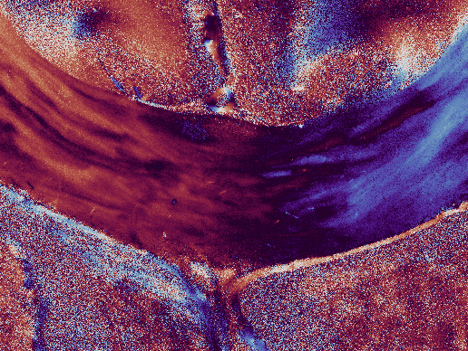

# polar_augment

[](https://arxiv.org/pdf/2411.07918)

## Description

This repository provides polarimetric image augmentations such as an [SO(2) rotation](https://github.com/hahnec/polar_augment/blob/master/scripts/simulate_rotation_script.py).

## Example showing polarimetric azimuth maps after SO(2) rotation

|  |  |  |
|:--------------------------:|:--------------------------:|:--------------------------:|
| **spatial-only rotation** | **spatial + polarimetric rotation** | **ground truth** |

<br>
<p align="center">
  
</p>

## Citation

<pre>@misc{hahne2024isometrictransformationsimageaugmentation,
      title={Isometric Transformations for Image Augmentation in Mueller Matrix Polarimetry}, 
      author={Christopher Hahne and Omar Rodriguez-Nunez and Éléa Gros and Théotim Lucas and Ekkehard Hewer and Tatiana Novikova and Theoni Maragkou and Philippe Schucht and Richard McKinley},
      year={2024},
      eprint={2411.07918},
      archivePrefix={arXiv},
      primaryClass={cs.CV},
      url={https://arxiv.org/abs/2411.07918}, 
} </pre>

## Installation

```bash
$ git clone github.com/hahnec/polar_augment
$ cd polar_augment
$ bash install.sh
```

## Usage

The provided transforms expect the image dimensions to be in PyTorch style `CxHxW`.

```python
import torch

from polar_augment.padding import mirror_rotate

# direct application
from polar_augment.rotation_mm import RandomMuellerRotation
rotate = RandomMuellerRotation(degrees=45, p=float('inf'), pad_rotate=mirror_rotate)
mm_img = torch.randn([128, 128, 4, 4]).flatten(2, 3).permute(2, 0, 1)
mm_img_rotated = rotate(mm_img)
print(mm_img_rotated.shape)

# application for calibration matrices (dataloader-friendly for raw data)
from polar_augment.rotation_raw import RandomPolarRotation
rotate = RandomPolarRotation(degrees=45, p=float('inf'), pad_rotate=mirror_rotate)
mm_img = torch.randn([128, 128, 4*3, 4]).flatten(2, 3).permute(2, 0, 1)
mm_img_rotated = rotate(mm_img)
print(mm_img_rotated.shape)

```

Alternatively, the transforms can be integrated during dataloading as for example by

```python
from torchvision.transforms import ToTensor
from polar_augment.flip_raw import RandomPolarFlip
from polar_augment.rotation_raw import RandomPolarRotation
from polar_augment.padding import mirror_rotate
from polar_dataset import PolarimetryDataset

# define list of transforms
transforms = [
        ToTensor(), 
        RandomPolarRotation(degrees=180, p=.5, pad_rotate=mirror_rotate), # rotation
        RandomPolarFlip(orientation=0, p=.5),   # horizontal flip
        RandomPolarFlip(orientation=1, p=.5),   # vertical flip
        RandomPolarFlip(orientation=2, p=.5),   # combined horizontal and vertical flip
    ]

# pass transforms to your dataset
PolarimetryDataset(some_file_path, transforms=transforms)

```

where the augmentation can then be applied to frames and labels within the ```PolarimetryDataset```

```python

class PolarimetryDataset(Dataset):
    def __init__(
            self, 
            path, 
            transforms=[], 
        ):
        self.load_file_paths(path)
        self.transforms = transforms

    def __getitem__(self, i):

        frame = load_file(self.frame_paths[i])
        label = load_file(self.label_paths[i])

        for transform in self.transforms:
            frame, label = transform(frame, label=label)

```
