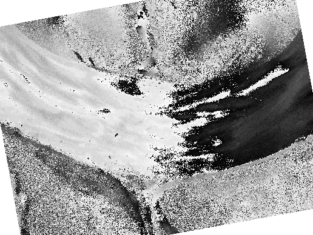

# polar_augment

## Description

This repository provides polarimetric image augmentations such as an [SO(2) rotation](simulate_rotation_script.py).

## Example showing polarimetric azimuth after SO(2) rotation alignment

