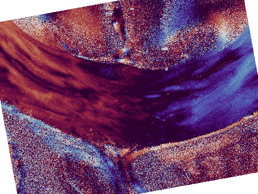

# polar_augment

## Description

This repository provides polarimetric image augmentations such as an [SO(2) rotation](simulate_rotation_script.py).

## Example showing polarimetric azimuth maps after SO(2) rotation

|  |  |
|:--------------------------:|:--------------------------:|
| **spatial-only**          | **spatial+polarimetric**          |
